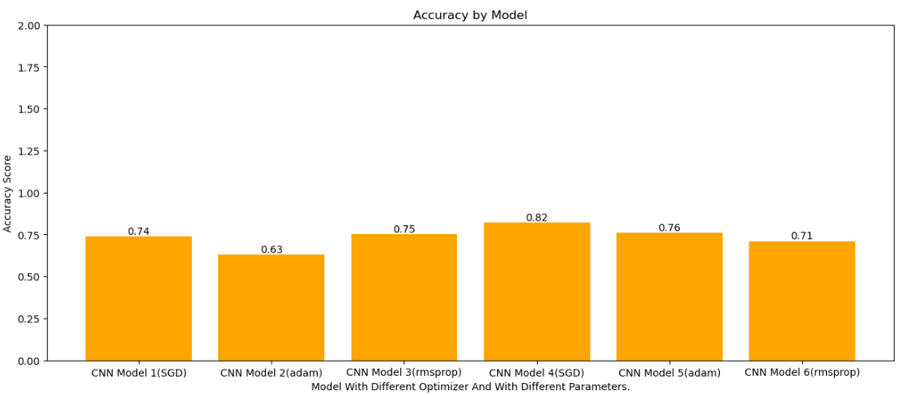

# Skin Cancer Prediction Using CNN

Welcome to the Skin Cancer Prediction project! This repository contains a Convolutional Neural Network (CNN) model designed to predict skin cancer using deep learning techniques.

## Overview

This project aims to build an accurate skin cancer detection model utilizing CNN architecture. By leveraging data augmentation and tuning hyperparameters, the model achieves a classification accuracy of 82%. This can aid in early detection and improve patient outcomes in dermatology.

## Features

- **CNN Architecture**: Designed with 2D convolutional layers and max pooling to effectively extract features from images.
- **Data Augmentation**: Implemented techniques to enhance generalization and robustness of the model.
- **Performance**: Achieved an accuracy of 82% on the validation dataset.

## Project Structure

- `Skin_Cancer_Prediction.ipynb`: Jupyter Notebook containing the model implementation, training, and evaluation.
- `Skin_Data/Cancer_Non_Cancer`: Directory containing the dataset used for training and testing the model.
- `requirements.txt`: List of required Python packages.

## Technologies Used

- Python
- TensorFlow
- Keras
- NumPy
- Pandas
- Matplotlib

## Installation

To set up the project locally, follow these steps:

1. Clone the repository:
   ```bash
   git clone https://github.com/TejasWaghmare18/Skin-Cancer-Prediction.git

2. Navigate to the project directory:
   ```bash
   cd Skin-Cancer-Prediction

3. Install the required dependencies:
   ```bash
   pip install -r requirements.txt

## Model Configuration
- Batch Size: 7
- Loss Function: Binary cross-entropy
- Hyperparameters: Varying stride, filter sizes, and max pooling sizes were used to optimize performance.

## Comparative Study


